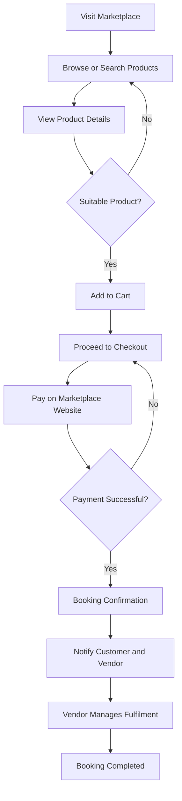

# Customer Journey

This flow illustrates how a customer discovers travel products, completes a booking, and receives fulfilment.

## Key Business Rules

* Customers can browse and search available travel products.
* Product details are available before booking.
* Payments are completed on the marketplace website.
* Successful payments trigger booking confirmation and notifications.
* The responsible vendor or internal department manages fulfilment.
