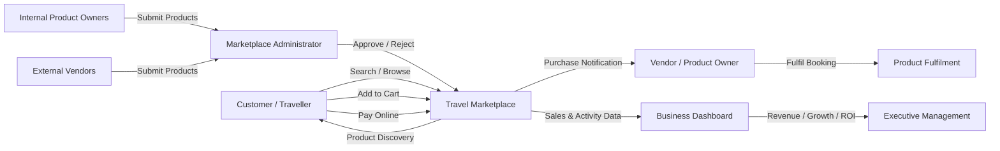

# Marketplace Ecosystem

## Purpose

This diagram shows the main actors and business flows within the travel marketplace.



## Core Marketplace Flow

```text
Internal Product Owners ──┐
                          ├──> Product Submission
External Vendors ─────────┘
                                  ↓
                         Marketplace Administrator
                                  ↓
                         Approve / Reject Product
                                  ↓
                         Customer Marketplace
                                  ↓
                    Search → Product → Cart → Payment
                                  ↓
                         Purchase Confirmation
                                  ↓
                         Vendor / Product Owner
                                  ↓
                            Fulfilment
                                  ↓
                         Business Reporting
                                  ↓
                         Executive Management
```

## Key Actors

### Customer / Traveller

Discovers marketplace products, reviews product information, adds products to the cart, completes payment, and receives confirmation.

### Internal Product Owners

Create and manage products owned by internal departments while following the same marketplace governance process.

### External Vendors

Register on the marketplace, submit products, receive approved bookings, and fulfil customer purchases.

### Marketplace Administrator

Provides central marketplace governance by reviewing submitted products and controlling approval and visibility.

### Travel Marketplace

Provides the shared customer and transaction experience:

* Product discovery
* Search and browsing
* Product details
* Cart
* Checkout
* Online payment
* Purchase confirmation

### Vendor / Product Owner

Receives purchase information and is responsible for fulfilling the purchased product or service.

### Executive Management

Uses marketplace reporting to evaluate:

* Internal product revenue
* External vendor revenue
* Customer growth
* Vendor growth
* Marketplace performance
* ROI

---

## Operating Principle

> **Centralise what needs consistency; decentralise what requires product ownership.**

### Centralised

* Marketplace governance
* Product approval
* Customer marketplace experience
* Checkout and payment
* Marketplace reporting

### Decentralised

* Product ownership
* Product-specific decisions
* Customer fulfilment
* Vendor operations
* Service delivery

---

## Business Value Flow

**Supply**

Internal + External Products

↓

**Governance**

Review + Approval

↓

**Demand**

Customer Discovery

↓

**Transaction**

Cart + Payment

↓

**Fulfilment**

Vendor / Product Owner

↓

**Business Value**

Revenue + Customer Growth + Vendor Growth + ROI
