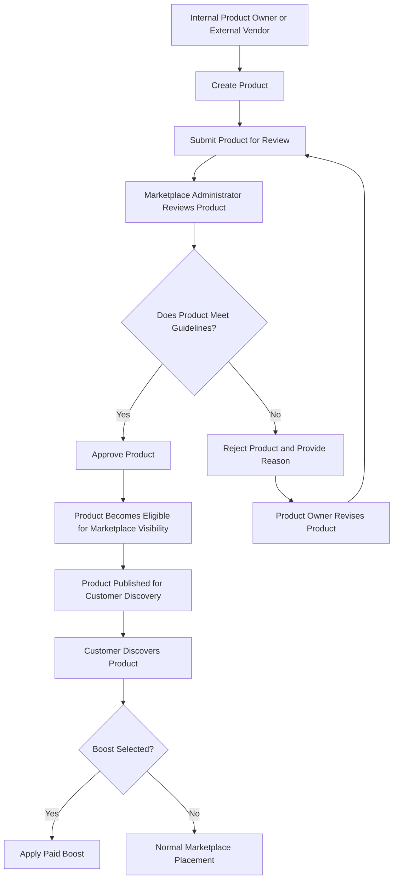

# Product Approval Flow

## Purpose

This diagram illustrates the process for submitting, reviewing, approving, and publishing products on the travel marketplace.

The process applies to both internal product owners and external vendors. Its purpose is to ensure that products are reviewed before becoming visible to customers.

## Process Flow

## Process Steps

| Step | Actor                                    | Activity                                                     | Expected Outcome                                    |
| ---- | ---------------------------------------- | ------------------------------------------------------------ | --------------------------------------------------- |
| 1    | Internal Product Owner / External Vendor | Creates a product listing                                    | Product information is prepared for submission      |
| 2    | Product Owner / Vendor                   | Submits the product                                          | Product enters the review process                   |
| 3    | Marketplace Administrator                | Reviews the submitted product against marketplace guidelines | Product is assessed consistently                    |
| 4A   | Marketplace Administrator                | Approves a compliant product                                 | Product becomes eligible for marketplace visibility |
| 4B   | Marketplace Administrator                | Rejects a product that does not meet requirements            | Rejection reason or feedback is provided            |
| 5    | Product Owner / Vendor                   | Revises a rejected product where applicable                  | Updated product can be resubmitted                  |
| 6    | Marketplace                              | Makes the approved product available for customer discovery  | Customer-facing visibility is enabled               |
| 7    | Product Owner / Vendor                   | Selects paid boosting where desired                          | Additional visibility can be purchased              |
| 8    | Customer                                 | Discovers and reviews the product                            | Customer can proceed toward purchase                |

## Key Business Rules

1. **Approval before visibility:** A product must be approved before it becomes visible to customers.
2. **Consistent governance:** Internal and external products follow the same core approval process.
3. **Rejection feedback:** Rejected products should include a reason or feedback to guide the product owner.
4. **Resubmission:** A product owner can revise a rejected product and submit it again for review.
5. **Boosting is optional:** Product owners can choose paid boosting where this option is available.
6. **Boosting does not replace approval:** A paid boost cannot bypass the product approval requirement.
7. **Neutral product governance:** Internal products should not receive preferential treatment simply because they are owned by the company.

## Exception Handling

| Exception                                    | Expected Handling                                              |
| -------------------------------------------- | -------------------------------------------------------------- |
| Product does not meet marketplace guidelines | Reject and provide feedback                                    |
| Product requires correction                  | Product owner revises and resubmits                            |
| Product has not been approved                | Keep it unavailable to customers                               |
| Product owner wants more visibility          | Offer the applicable paid boost option for an eligible product |

## BA Contribution

The marketplace approval workflow reflects a key business analysis contribution: turning a strategic concern about product quality and fair treatment into a defined operational process.

The proposed Marketplace Administrator role created a central point of accountability for product approval, helping the marketplace accommodate internal departments and external vendors under consistent governance.

## Key Takeaway

**Product submission → Review → Approval or rejection → Customer visibility**

This process supports marketplace quality, consistent governance, and a scalable model for onboarding products from multiple suppliers.
