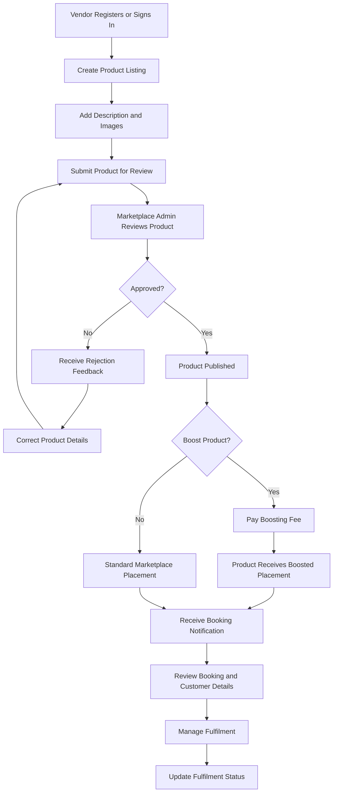

# Vendor Journey

This flow illustrates how internal departments and external vendors submit products to the marketplace, obtain approval, and manage customer bookings.

## Key Business Rules

* Internal and external providers follow the same core product approval rules.
* Products must be approved before publication.
* Rejected products receive feedback so vendors can make corrections and resubmit.
* Paid boosting is optional and distinct from standard product placement.
* Vendors or responsible internal departments manage bookings and fulfilment after purchase.
